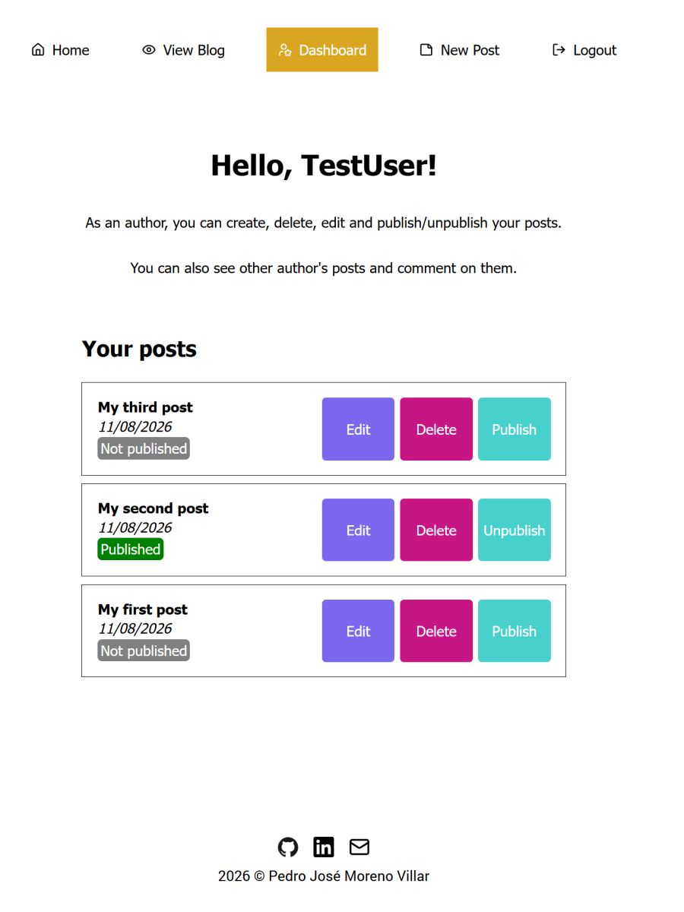
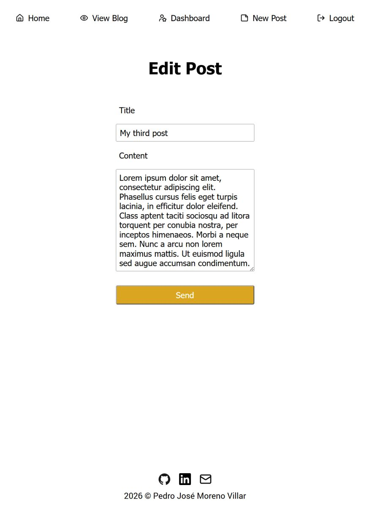
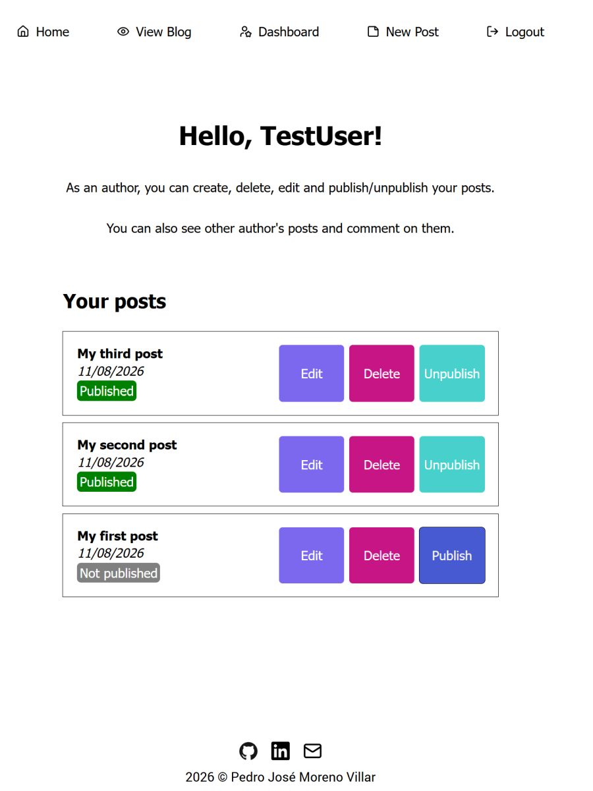

# Blog admin client

React admin interface for the full-stack blog platform. Authors can create, edit, delete, publish, and unpublish posts through the shared backend.

[Live Demo](https://blog-admin-client-41a747f76173.herokuapp.com/) | Demo: `demo@example.com` / `demo1234`

See: [Backend API](https://github.com/pedromorenovillar/blog_backend?tab=readme-ov-file) • [Public Client](https://github.com/pedromorenovillar/blog_public-client)

| <br>Admin dashboard | <br>New post | <br>Edit post | <br>Publish post |
| ----------------------------------------------------------------- | --------------------------------------------------------- | ----------------------------------------------------------- | ----------------------------------------------------------------- |

## Features

- **Post management**: Create, edit, and delete blog posts
- **Publishing controls**: Publish and unpublish posts for public visibility
- **Protected author access**: Restrict post management to authenticated users with author privileges
- **Client-side state and routing**: Context API manages authentication state and React Router handles navigation
- **API client abstractions**: Modular API clients in `/src/api`

## Tech Stack

- React 19, Vite, React Router 7
- Fetch API, Context API

## Setup

```bash
npm install
npm run dev
```

The app starts on `http://localhost:5174`. It requires a running [blog backend](https://github.com/pedromorenovillar/blog_backend).

## Context

Admin client for The Odin Project's [Blog API assignment](https://www.theodinproject.com/lessons/node-path-nodejs-blog-api), backed by a shared Express REST API and paired with a separate public client.
